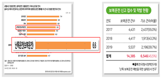
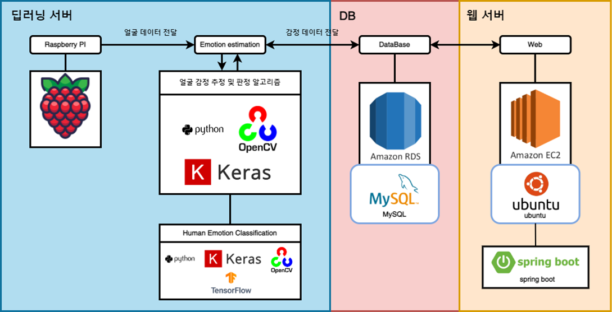
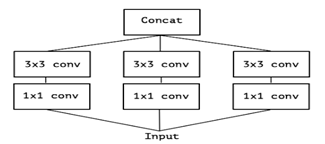
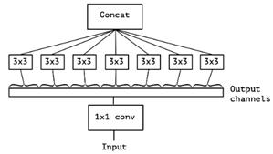
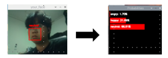
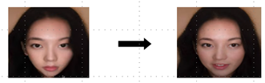
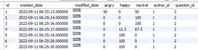
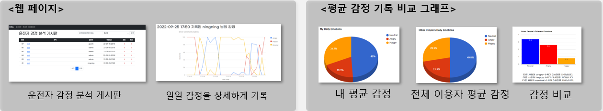

# <p align="center">운전자 주의 경고 시스템에 관한 연구</p>
### **<p align="center">전민경, 홍승표</p>**

**<p align="center">인천대학교 임베디드시스템공학과</p>**

**<p align="center">인천대학교 임베디드시스템공학과</p>**

**<p align="center">0313alsrud@inu.ac.kr(전민경), ghdtmdvy2@inu.ac.kr(홍승표)</p>**

## <p align="center">A Study on the Driving Warning Systems</p>

**<p align="center">Seung -Pyo Hong, Min-Kyung Jun,** 

**<p align="center">Dept. of Embedded System Engineering, Incheon University** 

**<p align="center">Dept. of Embedded System Engineering, Incheon University**


# <p align="center">도커 서버 배포/운영 하는법</p>

## git clone 하기
```bash
git clone https://github.com/ghdtmdvy2/Drive_Analysis_Web
```

## 프로젝트 폴더 이동
```bash
cd /Drive_Analysis_Web
```
## 현재 실행중인 컨테이너 중지 및 삭제
```bash
docker stop sb-server
# 안되면 : docker kill sb-server
docker rm -f sb-server
```
## 새 sb-sever 이미지 만들기 및 이미지 실행
```docker
# 이미지 만들기
docker build --force-rm -t sb-server .
# 이미지 실행
docker run -d --rm -it -p 8080:8080 --name sb-server sb-server
```
# <p align="center">아이디어 기능별 설명 및 목표</p>

## 요 약


최근 자동차 패러다임이 스마트카의 개념으로 급격히 변화하면서 생체신호를, 기반으로 감정을 인식하는 기술은 졸음에 의한 각종 사고들을 예방하는데 적극 사용되고 있다. 

자동차의 안전 시스템의 경우 운전자 주의 경고 기능을 이미 탑재하고 있으므로, 운전자 표정을 인식해 적절한 서비스를 제공하여 자동차의 엔터테인먼트 분야인 인포테이먼트 기술을 더욱 폭넓게 활용할 수 있다.

## 1. 서론

<p align="center"></p>

**<p align="center">(그림 1) 운전사고 유형과 비율</p>**

운전사고 유형과 비율 운전사고가 매년 증가 하면서 운전자 주의 경고 시스템이 개발되고 있다. 주로 운전 사고 비율이 높은 졸음운전은 서비스가 많이 개발되고 있지만, 난폭운전, 보복운전에 대해서는 서비스가 많이 개발되고 있지 않다. 

보복운전과 난폭운전도 운전사고 비율에서 항상 높은 순위를 차지하고 있고 매년 증가하고 있는 추세라는 것을 위의 **(그림1)** 을 보면 알 수 있다. 졸음운전은 운전자의 의도와 상관없이 일어나지만 보복운전과 난폭운전은 운전자가 우발적인 감정으로 인해 의도적으로 하게 된다. 

그래서 이를 예방하는 서비스를 개발한다면, 교통사고 비율을 줄이는 데 많은 도움이 될 수 있다.

## 2. 본론

### 2-1 서비스 구성도
---

<p align="center"></p>

**<p align="center">(그림 2) 시스템 구성도</p>**

시스템 구성도 Pi Camera 모듈을 통해 실시간 영상을 수집하여 Open CV로 얼굴 데이터를 가공한다. 

그 후 수집된 얼굴 데이터 기반으로 TensorFlow를 이용하여 상황에 맞게 라벨링을 해준다. 가져온 데이터를 Arduino로 전달하여 상황에 맞게 처리하고, Web에서는 가져온 데이터를 그래프화 시켜 사용자의 일일 감정을 기록하게 된다. 

이를 사용해 운전자의 데이터를 축적해 웹페이지에서 자신의 운전 상태, 위험도를 파악할 수 있는 서비스를 제공해 운전자의 운전 습관을 파악할 수 있도록 도움을 준다.


### 2-2 얼굴인식 모델 Xception
---

운전자의 얼굴 표정을 인식하는데 사용된 모델은 Xception이다. Xception 모델은 Inception 모델에서 발전된 것으로 딥러닝 모델 경량화를 목적으로 만들어진 모델이다.

<p align="center"></p>

**<p align="center">(그림 3) Inception module</p>**

<p align="center"></p>

**<p align="center">(그림 4) Xception module</p>**


Xception module은 Input 부분을 대규모 1x1 convolution으로 줄이고 모든 channel을 분리시켜 output channel당 3x3 convolution을 해주기 때문에 channel wise 와 spatial mapping을 완전히 분리해 준다. 

이로 인해1개의 kernel cross-channel correlation과 spatial correlation 로 과를 동시에 학습시키는 Inception모델의 단점을 보완하고 위의 두 가지를 독립적으로 살펴볼 수 있게 함으로써 이 프로세스를 좀 더 쉽고 효율적으로 만든다는 장점이 있다.

<p align="center"></p>

**<p align="center">(그림 5) Xception을 이용한 얼굴 인식</p>**

---
### **2-3 데이터 생성**
---

모델 학습 시 부족한 데이터를 보충하기 위해 GAN(Generative Adversarial Newtwork)을 이용한 모델로 데이터를 생성했다. 

GAN 알고리즘은 적대적 학습을 통해 생성기와 판별기가 동시에 경쟁하듯이 학습되기 때문에 다른 생성망 보다 더 사실과 가까운 데이터를 생성할 수 있다. 

styleGAN2로 이미지들을 합성하여 새로운 얼굴 이미지를 만들어 내고 styleCLIP을 이용해 text 만으로 이미지 데이터의 표정을 바꿔주는 알고리즘을 사용해 이 연구에 사용되는netural(무표정), happy(웃는 표정), angry(화난 표정)의 데이터들을 만들어 냈다.

<p align="center"></p>

**<p align="center">(그림 6) styleGAN2를 이용한 이미지 생성</p>**

---
### 2-4 딥러닝 서버
---

딥러닝 서버에서는 라즈베리 파이 카메라를 통해 실시간 프레임을 받게 된다. 

서버 내 딥러닝 모델을 통해 얼굴 인식과 감정 분류 후 DB의 site_users 테이블에 결과를 저장하고 Spring Boot 서버로 데이터를 전송한다. DB에 저장된 데이터는 사용자의 일일 감정 그래프 기능을 제공하는 서비스에 사용된다.

<p align="center"></p>

**<p align="center">(그림 7) 데이터 베이스 테이블</p>**

(그림 7)에서 사용자를 구분하는 고유한 값인 id, 감정이 기록된 날짜인 created_date, 각 감정의 백분율을 기록하는 angry, happy, neutral의 감정들이 기록 되고, 작성자의 id를 알려주는 author_id, 어떤 게시판에 기록된 id를 알려주는 question_id 를 나타냈다.

---
### 2-5 웹 서버
---

<p align="center"></p>

**<p align="center">(그림 8) 웹 서비스 페이지</p>**

Spring boot는 딥러닝 서버로부터 표정 결과(angry, happy, neutral), 사용자 id(author_id), 게시판 id(question_id), 등록된 날짜(created_date)의 데이터를 수신하게 되면 운전자의 일일 감정이 기록 된 것이 제공 된다. 

각 감정이 기록된 것은 링크로 되어 있는데 그 링크를 들어가면 상세 페이지로 접속하게 된다. 상세 페이지에 들어갔을 때 구글 Chart API의 그래프 기능을 이용하여 해당 운전자의 일일 감정을 시각화하여 보여주게 된다.

## 3. 결론

 Xception 모델을 표정 데이터를 학습하였고, 부족한 데이터들은 GAN을 이용해 새로운 이미지를 생성하여 보충하였다. 이 모델을 활용해 운전자의 감정을 추출해 운전자가 즉각적으로 감정을 완화시킬 수 있는 서비스(향, 조명)을 제공한다. 

또한 운전자의 표정 데이터를 그래프화 하여 자신의 운전 상태를 파악할 수 있는 웹 서비스도 제공한다. 

## 참고문헌

[1] 이용주, 문용혁, 박준용, 민옥기, “ 경량 딥러닝 기술 동향”, ETRI Journal, 2019 

[2] Google Chart API, [https://developers.google.com/chart](https://developers.google.com/chart)

[3] JPA Library, [https://spring.io/projects/spring-data-jpa](https://spring.io/projects/spring-data-jpa) 

[4] Spring Boot Spring Boot, [https://spring.io/projects/spring-boot](https://spring.io/projects/spring-boot)

- 본 논문은 과학기술정보통신부 정보통신창의인재양 성사업의 지원을 통해 수행한 ICT 멘토링 프로젝트 결과물입니다.-

## 딥러닝 서버 깃허브 주소
https://github.com/ghdtmdvy2/emotion_python
